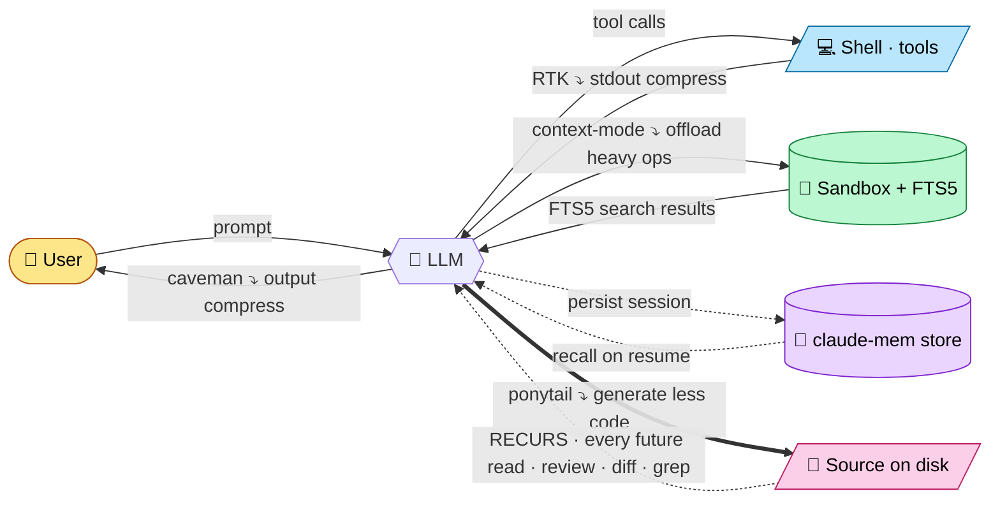

# tokenwar

[](https://github.com/oratelecom/tokenwar/actions/workflows/ci.yml)

**A 4-tool token-saving stack for Claude Code, plus _ponytail_ — a fifth axis that compresses the code itself.** The four tools each compress a different *transient* buffer (a response, a stdout, a fetch, a session). **ponytail** shrinks the **source the LLM writes to disk**, so its saving doesn't end with the call — it recurs on every future read of that file. Multi-provider token tracking (Codex, Gemini) values it all at native list prices.

Stack diagram: <https://studio.oratelecom.net/tokenwar/>

## The 4 tools

| Tool             | What it compresses                  | Buffer / flow                     |
| ---------------- | ----------------------------------- | --------------------------------- |
| **caveman**      | The LLM's response                  | `LLM → USER`                      |
| **RTK**          | Shell / tool stdout                 | `SHELL → LLM`                     |
| **context-mode** | Heavy data (HTTP, large files, MCP) | `LLM → SANDBOX → (FTS5) → LLM`    |
| **claude-mem**   | Cross-session knowledge             | `LLM → store → LLM (next session)`|

## Complementarity diagram



Each tool acts on a **distinct buffer**. No buffer is double-processed, so the gains stack additively. Four of the arrows are solid round-trips that fire **once per call**; the pink `ponytail` arrow is different — it writes a smaller artifact to disk, and the dotted return loop (`CODE -.-> LLM`) is the saving **replayed on every future read**.

## The generation axis — why ponytail is the genius one

The four tools above compress **transient buffers**: one response, one stdout, one fetch, one session hand-off. Each saving is real but **paid once** — on that call, then it's gone.

**ponytail** ([DietrichGebert/ponytail](https://github.com/DietrichGebert/ponytail), the lazy-senior-dev ruleset) acts one buffer further down: the **code the LLM writes**. It enforces a YAGNI ladder — stdlib before custom, native feature before dependency, one line before fifty, deletion before addition — so the model emits the *smallest correct* diff instead of an over-engineered one.

That cuts tokens **twice**, and the second cut is the one nobody counts:

1. **At generation** — less code emitted = fewer **output** tokens, right now. (Output tokens are the expensive ones.)
2. **At every future read** — code that was never written is code no one ever re-reads, reviews, greps, diffs, or feeds back into context. A 9-line endpoint instead of a 5-file / 3-class one is ~80% fewer **input** tokens on *every* later session that opens that file, for the life of the codebase.

> **The other four save on the _conversation_. ponytail saves on the _artifact_.**
> Its gain is the only one that **recurs** — it compounds every time the file is touched again, by you or by any tool in this stack reading it back. Generation is the down-payment; maintenance is the dividend.

No fabricated number: ponytail is a prompt include (`@ponytail.md` in `CLAUDE.md`), not a metered process, so — exactly like caveman — it reports **presence** (`[ponytail on]`), never a token count. To measure it, A/B the same task with `/ponytail` on vs off and diff the output tokens; the [`examples/`](https://github.com/DietrichGebert/ponytail/tree/main/examples) in the ponytail repo show the before/after diffs.

## Why complementary (not conflicting)

The tokenwar `check.sh` script enforces 4 rules:

| Rule | What it verifies                                                                   | Status                  |
| ---- | ---------------------------------------------------------------------------------- | ----------------------- |
| R1   | Single `PreToolUse` Bash hook in `settings.json` (RTK only — no double-rewrite)    | settings.json inspected |
| R2   | `claude-mem` writes to `~/.claude-mem`, `context-mode` to `~/.claude/projects/...` | Disjoint storage sinks  |
| R3   | RTK targets tool stdout; caveman targets LLM output                                | Disjoint buffers        |
| R4   | All 4 installed at current versions                                                | `claude plugin list`    |

When all four PASS, the verdict is `COMPLEMENTARY`.

## Commands

Inside Claude Code (`/tokenwar <subcommand>`) or standalone (`bash ~/.claude/skills/tokenwar/scripts/<script>.sh`):

| Command | What it does |
| --- | --- |
| `/tokenwar status` | Health of the 4 tools — installed, enabled, version |
| `/tokenwar gain` | Per-tool token savings + per-provider (Codex/Gemini native telemetry) + **monthly $ value** |
| `/tokenwar upgrade` | Bump each tool to latest (asks confirmation) |
| `/tokenwar check` | Conflict detector — verifies the 4 stack additively |
| `/tokenwar test` | End-to-end ping: is each tool actually working? |
| `/tokenwar doctor` | Full pipeline: status → test → check → gain |

## Status in every CLI (Claude, Codex, Gemini)

The persistent **bottom status bar** is a Claude Code feature — it ships a
`statusLine` API and tokenwar wires it automatically. **Codex and Gemini do not
expose a status-bar API** (their footers are hardcoded; their hooks inject only
into the model context, not the screen). So tokenwar surfaces the stack the best
way each CLI allows, with **zero daily effort** — `install.sh` wires it once:

| CLI         | What you get                                                          |
| ----------- | --------------------------------------------------------------------- |
| Claude Code | Native persistent bottom bar (always visible)                         |
| Codex       | Launch banner + `tokenwar status` reminder + inline upgrade prompt    |
| Gemini CLI  | Launch banner + `tokenwar status` reminder + inline upgrade prompt    |

After install you simply type `codex` or `gemini` as usual — the banner prints,
and if updates are pending you get **"⬆ N updates available. Upgrade now? [y/N]"**
which bumps the 4 tools. A `tokenwar` command also works in any shell:

```bash
tokenwar status     # state of the 4 tools + providers
tokenwar gain       # token savings + monthly $ value
tokenwar upgrade    # bump the 4 tools (asks confirmation)
tokenwar doctor     # status → check → gain
```

> The banner is silent for non-interactive launches (`codex exec`,
> `gemini -p …`, pipes) so it never pollutes scripted output.

## Quick start

One-liner install (clone + chmod + wire statusline):

```bash
curl -fsSL https://raw.githubusercontent.com/oratelecom/tokenwar/main/install.sh | bash
```

Then activate the four tools from inside Claude Code:

```
/tokenwar activate
```

Uninstall:

```bash
curl -fsSL https://raw.githubusercontent.com/oratelecom/tokenwar/main/uninstall.sh | bash
```

### Manual install

```bash
git clone https://github.com/oratelecom/tokenwar ~/.claude/skills/tokenwar
chmod +x ~/.claude/skills/tokenwar/scripts/*.sh

# Diagnose current state
bash ~/.claude/skills/tokenwar/scripts/status.sh

# Verify complementarity
bash ~/.claude/skills/tokenwar/scripts/check.sh

# Token savings report (per-tool + monthly $ value)
bash ~/.claude/skills/tokenwar/scripts/gain.sh
```

`gain.sh` reads each tool from its **own native telemetry** — never fabricated:
RTK (`rtk gain`), context-mode (`ctx_stats`), claude-mem
(`~/.claude-mem/chroma-sync-state.json` stored-memory counts). caveman is a
style-only nudge with no measurable buffer, so it is always `N/A`. It also
prints a per-month breakdown from `rtk gain --monthly`, valuing each month's
saved tokens at Claude and Codex input list prices (the API-equivalent $ saved).

Wire the combined statusline (Claude Code, `~/.claude/settings.json`):

```json
"statusLine": {
  "type": "command",
  "command": "bash ~/.claude/skills/tokenwar/scripts/tokenwar-statusline.sh"
}
```

Statusline renders `[ctx <v>] [mem <v>] [rtk <saved>] [caveman <v>] [ponytail on]` — green if active, red if down. The `ponytail` badge is presence-only (green `on` when `@ponytail.md` is wired into `~/.claude/CLAUDE.md`, red `off` otherwise) — no version, no telemetry, by design. A yellow `⬆` is appended to any tool with an available update (from the throttled `check-updates.sh` cache, refreshed in the background), and when ≥1 update exists the bar ends with a `⬆ N updates · /tokenwar upgrade` call-to-action. The bar is **Claude-only** — Codex/Gemini are tracked in `/tokenwar gain`, not on the Claude status bar.

## Settings.json wipe protection

Claude Code can rewrite `~/.claude/settings.json` on session start (migration logic). A backup is kept at `~/.claude/settings.local.json` and a restore script merges it back:

```bash
bash ~/.claude/skills/tokenwar/scripts/restore-settings.sh
```

Add to `~/.bashrc` to auto-restore before each Claude Code launch:

```bash
alias claude='bash ~/.claude/skills/tokenwar/scripts/restore-settings.sh && command claude'
```

## Tests + CI

```bash
bats tests/
```

CI on every push to `main` and every PR — installs bats + shellcheck, runs full suite on `ubuntu-latest`.

## Credits

**Powered by [Ora Studio](https://studio.oratelecom.net) · [Ora Telecom](https://oratelecom.com)** — token economics, productized.

Our open-source footprint on the 4-tool stack:

| Status | Project | Role |
| :----: | ------- | ---- |
| ✓ | **RTK**          | upstream contributor |
| ✓ | **context-mode** | upstream contributor |
| ✓ | **claude-mem**   | upstream contributor |
| ✦ | **caveman**      | Ora maintenance landing soon |

## License

[MIT](LICENSE) — © 2026 Ora Telecom. Use, fork, ship — no strings.
