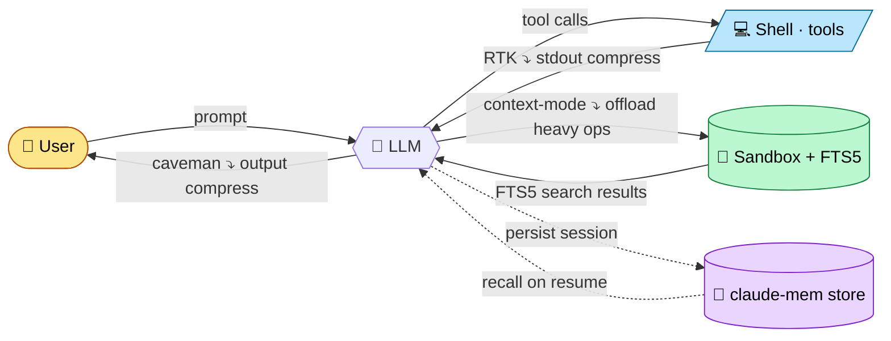

# slimstack

[](https://github.com/ousamabenyounes/slimstack/actions/workflows/ci.yml)

**A 4-tool token-saving stack for Claude Code.** Each tool compresses a different buffer — they stack without overlap.

Live preview: <https://studio.oratelecom.net/slimstack/>

## The 4 tools

| Tool             | What it compresses                  | Buffer / flow                     |
| ---------------- | ----------------------------------- | --------------------------------- |
| **caveman**      | The LLM's response                  | `LLM → USER`                      |
| **RTK**          | Shell / tool stdout                 | `SHELL → LLM`                     |
| **context-mode** | Heavy data (HTTP, large files, MCP) | `LLM → SANDBOX → (FTS5) → LLM`    |
| **claude-mem**   | Cross-session knowledge             | `LLM → store → LLM (next session)`|

## Complementarity diagram



Each tool acts on a **distinct buffer**. No buffer is double-processed, so the gains stack additively.

## Why complementary (not conflicting)

The slimstack `check.sh` script enforces 4 rules:

| Rule | What it verifies                                                                   | Status                  |
| ---- | ---------------------------------------------------------------------------------- | ----------------------- |
| R1   | Single `PreToolUse` Bash hook in `settings.json` (RTK only — no double-rewrite)    | settings.json inspected |
| R2   | `claude-mem` writes to `~/.claude-mem`, `context-mode` to `~/.claude/projects/...` | Disjoint storage sinks  |
| R3   | RTK targets tool stdout; caveman targets LLM output                                | Disjoint buffers        |
| R4   | All 4 installed at current versions                                                | `claude plugin list`    |

When all four PASS, the verdict is `COMPLEMENTARY`.

## Quick start

```bash
git clone https://github.com/ousamabenyounes/slimstack ~/.claude/skills/slimstack
chmod +x ~/.claude/skills/slimstack/scripts/*.sh

# Diagnose current state
bash ~/.claude/skills/slimstack/scripts/status.sh

# Verify complementarity
bash ~/.claude/skills/slimstack/scripts/check.sh

# Token savings report
bash ~/.claude/skills/slimstack/scripts/gain.sh
```

Wire the combined statusline (Claude Code, `~/.claude/settings.json`):

```json
"statusLine": {
  "type": "command",
  "command": "bash ~/.claude/skills/slimstack/scripts/perfia-statusline.sh"
}
```

Statusline renders `[ctx <v>] [mem <v>] [rtk <saved>] [caveman <v>]` — green if active, red if down.

## Settings.json wipe protection

Claude Code can rewrite `~/.claude/settings.json` on session start (migration logic). A backup is kept at `~/.claude/settings.local.json` and a restore script merges it back:

```bash
bash ~/.claude/skills/slimstack/scripts/restore-settings.sh
```

Add to `~/.bashrc` to auto-restore before each Claude Code launch:

```bash
alias claude='bash ~/.claude/skills/slimstack/scripts/restore-settings.sh && command claude'
```

## Tests + CI

```bash
bats tests/
```

CI on every push to `main` and every PR — installs bats + shellcheck, runs full suite on `ubuntu-latest`.

## License

MIT
