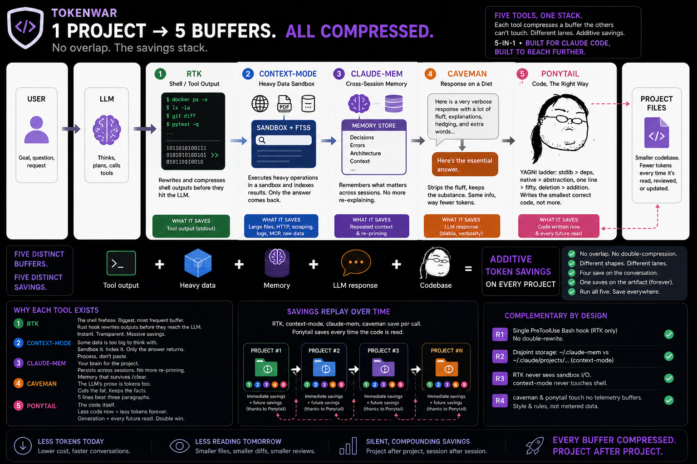
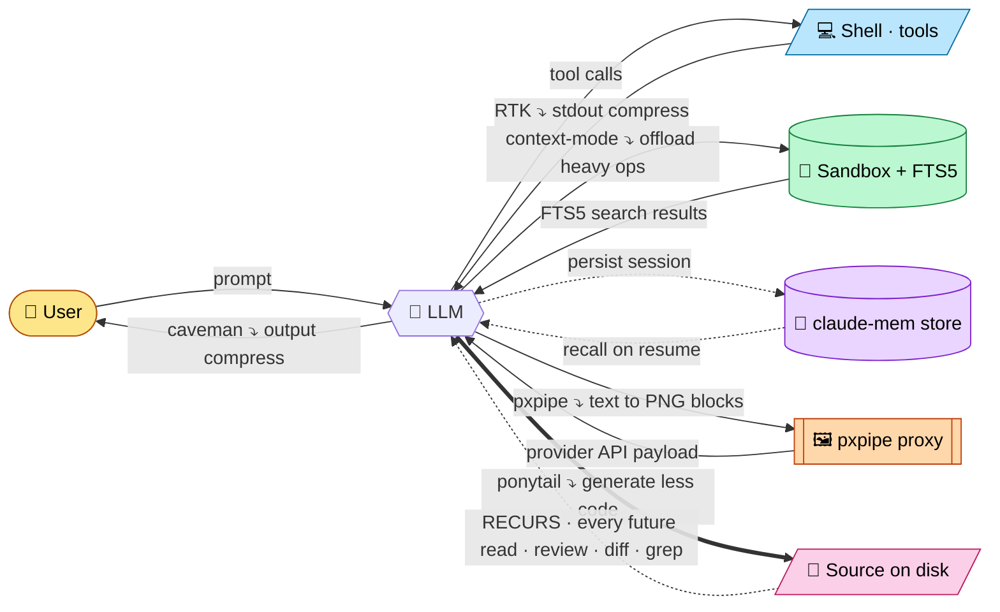

<h1 align="center">TokenWar</h1>

<p align="center">
  
</p>

<p align="center">
  
</p>

[](https://github.com/oratelecom/tokenwar/actions/workflows/ci.yml)

**Six token-saving tools, run as one stack.** Built for Claude Code first — but the stack reaches further: RTK, ponytail, caveman, context-mode, and pxpipe work across agents (Codex, Gemini, Kimi, Cursor…), with provider token usage tracked only where native telemetry exists. Each saves a buffer or lane the others can't touch — the model's response, tool stdout, heavy data, cross-session memory, provider-bound prompt payloads, and the code itself — so the savings stack instead of competing. None of the six is the headliner; the point is running all six at once. **6-in-1.**

Stack diagram: <https://studio.oratelecom.net/tokenwar/>

## The six tools

| Tool             | What it compresses                  | Buffer / flow                     |
| ---------------- | ----------------------------------- | --------------------------------- |
| **caveman**      | The LLM's response                  | `LLM → USER`                      |
| **RTK**          | Shell / tool stdout                 | `SHELL → LLM`                     |
| **context-mode** | Heavy data (HTTP, large files, MCP) | `LLM → SANDBOX → (FTS5) → LLM`    |
| **claude-mem**   | Cross-session knowledge             | `LLM → store → LLM (next session)`|
| **pxpipe**       | Provider-bound prompt/context payloads | `LLM → proxy → PNG blocks → API` |
| **ponytail**     | The code the LLM writes             | `LLM → CODE (recurs on read)`     |

## Complementarity diagram



Each tool acts on a **distinct buffer or lane** — no buffer is double-processed, so the gains stack additively. Five lanes save on the live conversation or provider request path; ponytail's lane saves on the artifact on disk (replayed on every future read via the dotted `CODE -.-> LLM` loop). Different shapes of saving, same stack.

## Why we picked each one — and why all six

No tool here is the headliner. Each was chosen because it owns a buffer the others physically can't reach, and on its own lane each is a killer. The point isn't any single one — it's that the six run together with zero overlap, so every saving stacks. **Six tools, one stack, 6-in-1.**

### RTK — the shell/tool firehose
Tool output is the heaviest, most frequent buffer in an agent loop: every `git diff`, `ls`, test run, and API dump lands in context raw. RTK rewrites those commands at the hook level so only a compressed form reaches the model — transparently, zero prompt overhead, written in Rust so it's instant. It's the single biggest *measured* saver in the stack. **Picked because the firehose is where the tokens actually are.**

### context-mode — the heavy-data sandbox
One large file read or HTTP fetch can blow the whole window in a single call. context-mode runs the operation in a sandbox and indexes the result in FTS5, so you keep the derived answer (~3 KB) while the raw bytes (~700 KB) never enter the conversation — *think in code, not in raw output*. **Picked because some payloads should be processed, never read.**

### claude-mem — memory across sessions
Re-explaining the project every time you `/clear` or restart is pure repeated cost. claude-mem persists decisions, errors, and context to a store that survives compaction and is recalled next session — no re-priming. **Picked because the most expensive tokens are the ones you'd otherwise pay twice.**

### pxpipe — the provider-bound prompt payload
[teamchong/pxpipe](https://github.com/teamchong/pxpipe) is a local API proxy that converts selected prompt/context text into PNG blocks before forwarding the request to the provider. That attacks a different lane from RTK: RTK compresses shell output before it enters model context; pxpipe compresses expensive prompt payloads at the provider boundary and records savings in `~/.pxpipe/events.jsonl`. **Picked because some repeated or bulky text is cheaper as pixels than as input tokens.**

### caveman — the response on a diet
The model's own prose is tokens too. caveman strips articles, filler, and hedging from what the LLM says while keeping the technical substance exact — terse output, same information. **Picked because a 5-line answer beats three paragraphs, every single turn.** (It's the prose twin of ponytail's code.)

### ponytail — the code itself
The lazy-senior-dev ruleset ([DietrichGebert/ponytail](https://github.com/DietrichGebert/ponytail)): a YAGNI ladder — stdlib before custom, native before dependency, one line before fifty, deletion before addition — so the model writes the *smallest correct* code, not an over-engineered one. Its saving lands twice: fewer **output** tokens at generation, then fewer **input** tokens on every future read/review/diff of a smaller file. **Picked because the cheapest code to maintain is the code that was never written.**

> Five save on the conversation/provider path, one saves on the artifact. One's a Rust hook, one's an MCP sandbox, one's a memory store, one's a proxy, one's a response filter, one's a ruleset. Different shapes, different lanes — that's exactly why they stack. Run one and you compress one buffer; run all six and almost nothing in the loop is left uncompressed. **That's the 6-in-1.**

> Honest accounting: RTK / context-mode / claude-mem / pxpipe report real telemetry; caveman and ponytail are presence-only (a style nudge and a plugin ruleset — no metered buffer), so they show `on`, never a fabricated number. pxpipe savings come only from its native `~/.pxpipe/events.jsonl`; if no events exist, tokenwar prints `N/A`. Measure ponytail by A/B-ing `/ponytail` on vs off — the [`examples/`](https://github.com/DietrichGebert/ponytail/tree/main/examples) show before/after diffs.

## Why complementary (not conflicting)

The tokenwar `check.sh` script enforces 4 rules:

| Rule | What it verifies                                                                   | Status                  |
| ---- | ---------------------------------------------------------------------------------- | ----------------------- |
| R1   | Single `PreToolUse` Bash hook in `settings.json` (RTK only — no double-rewrite)    | settings.json inspected |
| R2   | `claude-mem` writes to `~/.claude-mem`, `context-mode` to `~/.claude/projects/...` | Disjoint storage sinks  |
| R3   | RTK targets tool stdout; caveman targets LLM output                                | Disjoint buffers        |
| R4   | Core hook/plugin tools installed at current versions                               | `claude plugin list`    |

When all four PASS, the verdict is `COMPLEMENTARY`. ponytail isn't in the conflict table because it owns no hook, store, or output buffer — it only shapes what the model writes. pxpipe is tracked in `status`, `gain`, `updates`, and `upgrade`; it sits at the provider proxy boundary, separate from RTK's shell-output lane. Six tools, still zero overlap.

## Commands

Inside Claude Code (`/tokenwar <subcommand>`) or standalone (`bash ~/.claude/skills/tokenwar/scripts/<script>.sh`):

| Command | What it does |
| --- | --- |
| `/tokenwar status` | Health of the 6 tools — installed, enabled, version |
| `/tokenwar gain` | Per-tool token savings + per-provider telemetry/status (Codex/Gemini/Kimi) + **monthly $ value** |
| `/tokenwar upgrade` | Bump each tool to latest (asks confirmation) |
| `/tokenwar check` | Conflict detector — verifies the 4 stack additively |
| `/tokenwar test` | End-to-end ping: is each tool actually working? |
| `/tokenwar doctor` | Full pipeline: status → test → check → gain |

## Status in every CLI (Claude, Codex, Gemini, Kimi)

The persistent **bottom status bar** is a Claude Code feature — it ships a
`statusLine` API and tokenwar wires it automatically. **Codex, Gemini, and Kimi
do not expose a status-bar API** (their footers are hardcoded; their hooks
inject only into the model context, not the screen). So tokenwar surfaces the
stack the best way each CLI allows, with **zero daily effort** — `install.sh`
wires it once:

| CLI         | What you get                                                          |
| ----------- | --------------------------------------------------------------------- |
| Claude Code | Native persistent bottom bar (always visible)                         |
| Codex       | Launch banner + `tokenwar status` reminder + inline upgrade prompt    |
| Gemini CLI  | Launch banner + `tokenwar status` reminder + inline upgrade prompt    |
| Kimi Code CLI | Launch banner + `tokenwar status` reminder + inline upgrade prompt  |

After install you simply type `codex`, `gemini`, or `kimi` as usual — the banner
prints, and if updates are pending you get **"⬆ N updates available. Upgrade now?
[y/N]"** which bumps managed tools. A `tokenwar` command also works in any shell:

```bash
tokenwar status     # state of the 6 tools + providers
tokenwar gain       # token savings + monthly $ value
tokenwar upgrade    # bump managed tools (asks confirmation)
tokenwar doctor     # status → check → gain
```

> The banner is silent for non-interactive launches (`codex exec`,
> `gemini -p …`, `kimi -p …`, pipes) so it never pollutes scripted output.

## Quick start

One command — the whole stack: the 4 Claude Code plugins (context-mode, claude-mem, caveman, **ponytail**), the **RTK** binary (via rtk's official prebuilt installer), **pxpipe** (via pinned `pxpipe-proxy@0.10.0`), the statusline + shell functions, and RTK's hook:

```bash
curl -fsSL https://raw.githubusercontent.com/oratelecom/tokenwar/main/install.sh | bash -s -- --all
```

Restart Claude Code to load the plugins. `--all` = `--with-plugins --with-rtk --with-pxpipe`; use individual flags if you only want one part. RTK installs from a prebuilt binary (no toolchain, no compiling) on every major platform via rtk's own official installer. pxpipe installs from the pinned npm package `pxpipe-proxy@0.10.0`.

Prefer no surprise mutations? Drop the flags — `… | bash` just wires the statusline + shell functions, then `/tokenwar activate` installs the plugins on confirmation:

```bash
curl -fsSL https://raw.githubusercontent.com/oratelecom/tokenwar/main/install.sh | bash
/tokenwar activate
```

Uninstall:

```bash
curl -fsSL https://raw.githubusercontent.com/oratelecom/tokenwar/main/uninstall.sh | bash
```

### Manual install

```bash
git clone https://github.com/oratelecom/tokenwar ~/.claude/skills/tokenwar
chmod +x ~/.claude/skills/tokenwar/scripts/*.sh

# Diagnose current state
bash ~/.claude/skills/tokenwar/scripts/status.sh

# Verify complementarity
bash ~/.claude/skills/tokenwar/scripts/check.sh

# Token savings report (per-tool + monthly $ value)
bash ~/.claude/skills/tokenwar/scripts/gain.sh
```

`gain.sh` reads each tool from its **own native telemetry** — never fabricated:
RTK (`rtk gain`), context-mode (`ctx_stats`), claude-mem
(`~/.claude-mem/chroma-sync-state.json` stored-memory counts), and pxpipe
(`~/.pxpipe/events.jsonl` proxy events). caveman is a
style-only nudge with no measurable buffer, so it is always `N/A`. It also
prints a per-month breakdown from `rtk gain --monthly`, valuing each month's
saved tokens at Claude and Codex input list prices (the API-equivalent $ saved).

Wire the combined statusline (Claude Code, `~/.claude/settings.json`):

```json
"statusLine": {
  "type": "command",
  "command": "bash ~/.claude/skills/tokenwar/scripts/tokenwar-statusline.sh"
}
```

Statusline renders `[ctx <v>] [mem <v>] [rtk <saved>] [caveman <v>] [ponytail on]` — green if active, red if down. The `ponytail` badge reflects the plugin's real runtime mode: green with the active intensity (`on` for full, else `lite`/`ultra`) when the `ponytail@ponytail` plugin is enabled and not toggled off, red `off` when disabled or after `/ponytail off` — read live from the plugin's `~/.claude/.ponytail-active` flag, no version, no telemetry, by design. A yellow `⬆` is appended to any tool with an available update (from the throttled `check-updates.sh` cache, refreshed in the background), and when ≥1 update exists the bar ends with a `⬆ N updates · /tokenwar upgrade` call-to-action. The bar is **Claude-only** — Codex/Gemini/Kimi are tracked in `/tokenwar gain`, not on the Claude status bar.

## Settings.json wipe protection

Claude Code can rewrite `~/.claude/settings.json` on session start (migration logic). A backup is kept at `~/.claude/settings.local.json` and a restore script merges it back:

```bash
bash ~/.claude/skills/tokenwar/scripts/restore-settings.sh
```

Add to `~/.bashrc` to auto-restore before each Claude Code launch:

```bash
alias claude='bash ~/.claude/skills/tokenwar/scripts/restore-settings.sh && command claude'
```

## Tests + CI

```bash
bats tests/
```

CI on every push to `main` and every PR — installs bats + shellcheck, runs full suite on `ubuntu-latest`.

## Credits

**Powered by [Ora Studio](https://studio.oratelecom.net) · Ora Telecom** — token economics, productized.

Our open-source footprint on the stack:

| Status | Project | Role |
| :----: | ------- | ---- |
| ✓ | **RTK**          | upstream contributor |
| ✓ | **context-mode** | upstream contributor |
| ✓ | **claude-mem**   | upstream contributor |
| ✦ | **caveman**      | Ora maintenance landing soon |

## License

[MIT](LICENSE) — © 2026 Ora Telecom. Use, fork, ship — no strings.
