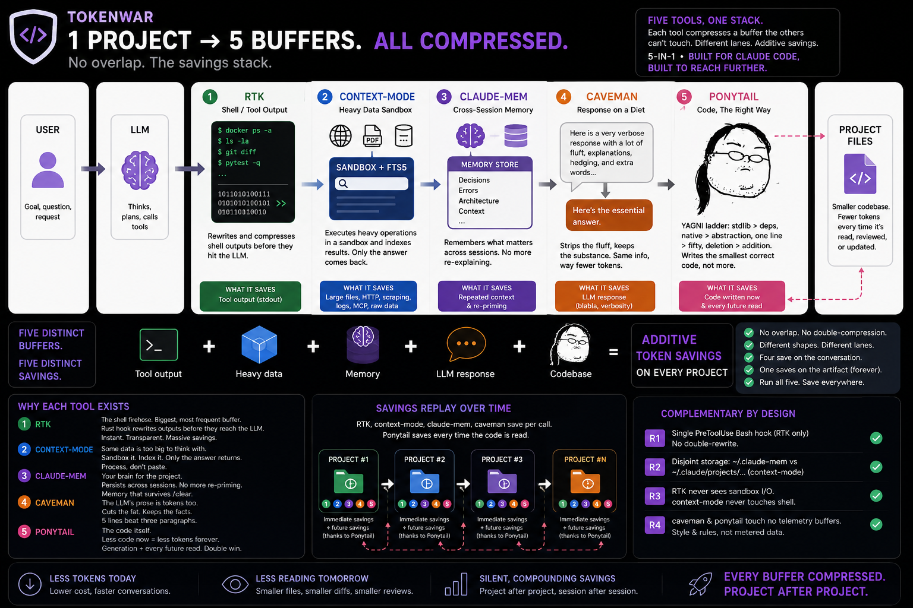

<h1 align="center">TokenWar</h1>

<p align="center">
  
</p>

<p align="center">
  
</p>

[](https://github.com/oratelecom/tokenwar/actions/workflows/ci.yml)

**Seven token-saving tools, run as one stack.** Built for Claude Code first — but the stack reaches further: RTK, ponytail, caveman, context-mode, pxpipe, and graphify work across agents (Codex, Gemini, Kimi, opencode, **GitHub Copilot CLI**, Cursor…), with provider token usage tracked only where native telemetry exists. Each saves a buffer or lane the others can't touch — the model's response, tool stdout, heavy data, cross-session memory, provider-bound prompt payloads, the repo's own shape, and the code itself — so the savings stack instead of competing. None of the seven is the headliner; the point is running all seven at once. **7-in-1.**

> The stack diagram above still pictures six lanes; graphify joined afterwards and the artwork has not been regenerated yet.

Stack diagram: <https://studio.oratelecom.net/tokenwar/>

## The seven tools

| Tool             | What it compresses                  | Buffer / flow                     |
| ---------------- | ----------------------------------- | --------------------------------- |
| **caveman**      | The LLM's response                  | `LLM → USER`                      |
| **RTK**          | Shell / tool stdout                 | `SHELL → LLM`                     |
| **context-mode** | Heavy data (HTTP, large files, MCP) | `LLM → SANDBOX → (FTS5) → LLM`    |
| **claude-mem**   | Cross-session knowledge             | `LLM → store → LLM (next session)`|
| **pxpipe**       | Provider-bound prompt/context payloads | `LLM → proxy → PNG blocks → API` |
| **graphify**     | Repo/doc discovery sweeps           | `REPO → graph → query → LLM`      |
| **ponytail**     | The code the LLM writes             | `LLM → CODE (recurs on read)`     |

Each tool acts on a **distinct buffer or lane** — no buffer is double-processed,
so the gains stack additively. Six lanes save on the live conversation or
provider request path; ponytail's lane saves on the artifact on disk and recurs
on every future read, review, diff, and grep. Different shapes of saving, same
stack.

## Why we picked each one — and why all seven

No tool here is the headliner. Each was chosen because it owns a buffer the others physically can't reach, and on its own lane each is a killer. The point isn't any single one — it's that the seven run together with zero overlap, so every saving stacks. **Seven tools, one stack, 7-in-1.**

### RTK — the shell/tool firehose
Tool output is the heaviest, most frequent buffer in an agent loop: every `git diff`, `ls`, test run, and API dump lands in context raw. RTK rewrites those commands at the hook level so only a compressed form reaches the model — transparently, zero prompt overhead, written in Rust so it's instant. It's the single biggest *measured* saver in the stack. **Picked because the firehose is where the tokens actually are.**

### context-mode — the heavy-data sandbox
One large file read or HTTP fetch can blow the whole window in a single call. context-mode runs the operation in a sandbox and indexes the result in FTS5, so you keep the derived answer (~3 KB) while the raw bytes (~700 KB) never enter the conversation — *think in code, not in raw output*. **Picked because some payloads should be processed, never read.**

### claude-mem — memory across sessions
Re-explaining the project every time you `/clear` or restart is pure repeated cost. claude-mem persists decisions, errors, and context to a store that survives compaction and is recalled next session — no re-priming. **Picked because the most expensive tokens are the ones you'd otherwise pay twice.**

### pxpipe — the provider-bound prompt payload
[teamchong/pxpipe](https://github.com/teamchong/pxpipe) is a local API proxy that converts selected prompt/context text into PNG blocks before forwarding the request to the provider. That attacks a different lane from RTK: RTK compresses shell output before it enters model context; pxpipe compresses expensive prompt payloads at the provider boundary and records savings in `~/.pxpipe/events.jsonl`. **Picked because some repeated or bulky text is cheaper as pixels than as input tokens.**

### graphify — the repo's shape, asked instead of grepped
[Graphify-Labs/graphify](https://github.com/Graphify-Labs/graphify) parses a repo — code, docs, SQL schemas, configs, PDFs — into a local knowledge graph with deterministic AST parsing and every edge explained. The lane it owns is *discovery*: "where is this wired", "what breaks if I change X", "how does the api reach the data layer". Without it an agent answers those with a burst of `rg`/`find`/`sed`/`cat` sweeps whose combined output is the single largest avoidable read in most logs — and RTK can only compress what those commands already printed, it cannot stop them being run. graphify replaces the sweep with one bounded `graphify query`. Its own `graphify benchmark` measures the delta on your graph (a 236-node graph here: ~15.7K tokens to read the corpus naively vs ~347 per graph query). **Picked because the cheapest discovery output is the one that was never printed.**

### caveman — the response on a diet
The model's own prose is tokens too. caveman strips articles, filler, and hedging from what the LLM says while keeping the technical substance exact — terse output, same information. **Picked because a 5-line answer beats three paragraphs, every single turn.** (It's the prose twin of ponytail's code.)

### ponytail — the code itself
The lazy-senior-dev ruleset ([DietrichGebert/ponytail](https://github.com/DietrichGebert/ponytail)): a YAGNI ladder — stdlib before custom, native before dependency, one line before fifty, deletion before addition — so the model writes the *smallest correct* code, not an over-engineered one. Its saving lands twice: fewer **output** tokens at generation, then fewer **input** tokens on every future read/review/diff of a smaller file. **Picked because the cheapest code to maintain is the code that was never written.**

> Six save on the conversation/provider path, one saves on the artifact. One's a Rust hook, one's an MCP sandbox, one's a memory store, one's a proxy, one's a graph, one's a response filter, one's a ruleset. Different shapes, different lanes — that's exactly why they stack. Run one and you compress one buffer; run all seven and almost nothing in the loop is left uncompressed. **That's the 7-in-1.**

> Honest accounting: RTK / context-mode / claude-mem / pxpipe report real telemetry; caveman and ponytail are presence-only (a style nudge and a plugin ruleset — no metered buffer), so they show `on`, never a fabricated number. graphify reports a *per-query* reduction ratio measured by its own `graphify benchmark`, which is not a cumulative saved-token counter — so tokenwar prints the ratio in the note and leaves the token column `N/A` rather than summing a per-query figure into the TOTAL. pxpipe savings come only from its native `~/.pxpipe/events.jsonl`; if no events exist, tokenwar prints `N/A`. Measure ponytail by A/B-ing `/ponytail` on vs off — the [`examples/`](https://github.com/DietrichGebert/ponytail/tree/main/examples) show before/after diffs.

## Why complementary (not conflicting)

The tokenwar `check.sh` script enforces 5 rules:

| Rule | What it verifies                                                                   | Status                  |
| ---- | ---------------------------------------------------------------------------------- | ----------------------- |
| R1   | Single `PreToolUse` Bash hook in `settings.json` (RTK only — no double-rewrite)    | settings.json inspected |
| R2   | `claude-mem` writes to `~/.claude-mem`, `context-mode` to `~/.claude/projects/...` | Disjoint storage sinks  |
| R3   | RTK targets tool stdout; caveman targets LLM output                                | Disjoint buffers        |
| R4   | Core hook/plugin/CLI tools installed (incl. rtk, pxpipe, graphify)                 | `claude plugin list` + `command -v` |
| R5   | Active providers use separate config directories                                   | Disjoint provider state |

When all five PASS, the verdict is `COMPLEMENTARY`. ponytail shapes what the
model writes; pxpipe is tracked in `status`, `gain`, `updates`, and `upgrade`
and sits at the provider proxy boundary, separate from RTK's shell-output lane;
graphify sits one step earlier still, cutting the discovery commands before RTK
ever has stdout to compress. Seven tools, still zero overlap.

## Commands

Inside Claude Code (`/tokenwar <subcommand>`) or standalone (`bash ~/.claude/skills/tokenwar/scripts/<script>.sh`):

| Command | What it does |
| --- | --- |
| `/tokenwar status` | Health of the 7 tools — installed, enabled, version |
| `/tokenwar gain` | Per-tool token savings + per-provider telemetry/status (Codex/Gemini/Kimi/opencode) + **monthly $ value** |
| `/tokenwar scan` | Local agent-log scan that estimates which token-saving tools would have helped most |
| `/tokenwar copilot` | Report which tools reach GitHub Copilot CLI; `copilot wire` points the missing ones at Copilot's hook / skills / MCP |
| `/tokenwar upgrade` | Bump each tool to latest (asks confirmation) |
| `/tokenwar check` | Conflict detector — verifies the 7 tools stack additively |
| `/tokenwar test` | End-to-end ping: is each tool actually working? |
| `/tokenwar doctor` | Full pipeline: status → test → check → gain |
| `/tokenwar disable <tool>` | Turn off one plugin (`context-mode`/`claude-mem`/`caveman`/`ponytail`) without uninstalling it. `rtk`, `pxpipe`, and `graphify` are binaries, not plugins — the command prints their own on/off mechanism instead |
| `/tokenwar enable <tool>` | Turn a disabled plugin back on |

## Local log scan

`tokenwar scan` is the recommendation layer. It reads local agent logs, detects
which clients are present, and estimates which TokenWar tools would have helped
most. It does **not** upload logs, call a provider, or present estimated numbers
as real telemetry.

```bash
tokenwar scan                  # scan detected local clients
tokenwar scan --all            # include every supported client
tokenwar scan --client codex   # scan one client
tokenwar scan --clients codex,vibe --json
tokenwar scan --apply          # ask before applying ENABLE recommendations
tokenwar scan --apply --yes    # apply ENABLE recommendations without prompting
```

Supported clients:

| Client | Default local roots | Default selection | Notes |
| --- | --- | --- | --- |
| Claude Code | `~/.claude` | Yes, when CLI or logs exist | Best coverage for plugin state and TokenWar-native setup. |
| Codex | `~/.codex` | Yes, when CLI or logs exist | Good shell, search, read, and prose signal from local state. |
| Gemini CLI | `~/.gemini` | Yes, when CLI or logs exist | Scan can recommend tools even when native token telemetry is unavailable. |
| Kimi Code CLI | `~/.kimi-code` | Yes, when CLI or logs exist | Local logs are scanned; token totals remain estimates. |
| opencode | `~/.local/share/opencode`, `~/.config/opencode` | Yes, when CLI or logs exist | Combines well with native usage telemetry from `tokenwar gain`. |
| GitHub Copilot CLI | `~/.copilot` | Yes, when CLI or logs exist | Session state under `~/.copilot/session-state`; pairs with native token telemetry from `tokenwar gain`. |
| Vibe/Ora agents | `~/.ora/tasks`, `~/.ora/contribute`, `~/.claude/contributebg/logs` | Yes, when logs exist | Covers background contribution and vibe-coding agent logs. |
| Cursor | `~/.cursor` | Yes, when CLI or logs exist | Reports `none` when the directory exists but no supported logs are found. |

Each root can be overridden without changing config:

```bash
TOKENWAR_CODEX_LOG_ROOT=/path/to/codex/logs tokenwar scan --client codex
TOKENWAR_SCAN_MAX_FILES=50 TOKENWAR_SCAN_MAX_BYTES_PER_FILE=65536 tokenwar scan --all
```

The decision column is intentionally blunt:

| Decision | Meaning |
| --- | --- |
| `KEEP` | The tool is already active or detected and the logs show useful signal. |
| `ENABLE` | The tool is installed but disabled, and the scan found enough matching signal. |
| `TRY` | The scan found opportunity, but TokenWar should benchmark or install a candidate first. |
| `TOO MUCH` | The signal is too small for the operational cost right now. |

Example from a local multi-agent scan:

```text
RTK                                  KEEP      270.2K  shell/test command signals
context-mode alternative             TRY       210.1K  heavy payload or scrape signals
graphify                             KEEP      180.1K  repo discovery signals
Probe / Stacklit / Serena            TRY       180.1K  repo discovery signals
claude-mem / OpenWiki                KEEP      120.1K  repeated memory/context signals
pxpipe                               KEEP       90.1K  scanned log tokens and long-line payloads
caveman                              ENABLE     72.0K  prose/review/summary signals
ponytail                             KEEP       15.5K  code-generation or diff signals
```

That example means: keep RTK, graphify, claude-mem, pxpipe, and ponytail; enable
caveman for operational chatter; test a lighter code-context layer before making
context-mode the default for code navigation. graphify carries a real state
(`OK` / `installed-disabled` / `not-installed`) because tokenwar manages it;
`Probe / Stacklit / Serena` stays a `candidate` row — benchmark one of those only
if discovery sweeps survive in the logs after graphify is in place.

`--apply` only applies direct TokenWar plugin toggles whose decision is
`ENABLE`. Today that means enabling `caveman`, `claude-mem`, or `ponytail` when
they are installed but disabled. It intentionally does not install new tools,
change RTK hooks, remove pxpipe, or choose a code-context alternative for you.
Those remain explicit setup decisions.

## Status in every CLI (Claude, Codex, Gemini, Kimi, opencode, Copilot)

The persistent **bottom status bar** is a Claude Code feature — it ships a
`statusLine` API and tokenwar wires it automatically. **Codex, Gemini, Kimi,
opencode, and GitHub Copilot CLI do not expose a status-bar API** (their footers
are hardcoded; their hooks inject only into the model context, not the screen).
So tokenwar surfaces the stack the best way each CLI allows, with **zero daily
effort** — `install.sh` wires it once:

| CLI         | What you get                                                          |
| ----------- | --------------------------------------------------------------------- |
| Claude Code | Native persistent bottom bar (always visible)                         |
| Codex       | Launch banner + `tokenwar status` reminder + update status hint       |
| Gemini CLI  | Launch banner + `tokenwar status` reminder + update status hint       |
| Kimi Code CLI | Launch banner + `tokenwar status` reminder + update status hint     |
| opencode    | Launch banner + `tokenwar status` reminder + update status hint       |
| GitHub Copilot CLI | Launch banner + `tokenwar status` reminder + update status hint |

After install you simply type `codex`, `gemini`, `kimi`, `opencode`, or `copilot` as usual —
the banner prints the stack bar. If updates are pending, the bar shows
**"⬆ N updates · /tokenwar upgrade"** as an informational hint only; upgrades
run only when you call `tokenwar upgrade` yourself. A `tokenwar` command also
works in any shell:

```bash
tokenwar status     # state of the 7 tools + providers
tokenwar gain       # token savings + monthly $ value
tokenwar scan       # local log scan + recommendations
tokenwar copilot    # which tools reach GitHub Copilot CLI (add `wire` to fix)
tokenwar upgrade    # bump managed tools (asks confirmation)
tokenwar doctor     # status → check → gain
tokenwar disable context-mode   # turn off one plugin without uninstalling it
tokenwar enable  context-mode   # turn it back on
```

> The banner is silent for non-interactive launches (`codex exec`,
> `gemini -p …`, `kimi -p …`, `opencode run …`, `copilot -p …`, `copilot --acp`,
> `copilot mcp/skill/plugin …`, pipes) so it never pollutes scripted output.

## The stack inside GitHub Copilot CLI

Being a tracked *provider* only gets you the numbers. The **tools** are published
for Claude Code and do not reach Copilot for free — each one has to be pointed at
Copilot's own extension points, of which there are exactly three: hooks
(`~/.copilot/hooks/*.json`), skills (`~/.copilot/skills/<name>/SKILL.md`, the
portable Agent-Skills format), and MCP (`~/.copilot/mcp-config.json`).

`tokenwar copilot` reports that mapping; `tokenwar copilot wire` applies it.

| Tool | Reaches Copilot via | Wiring |
| ---- | ------------------- | ------ |
| **rtk** | hook | `rtk init -g --copilot` — a `PreToolUse` hook plus user-level instructions |
| **graphify** | skill | `graphify copilot install` — its own native command |
| **caveman** | skill | `copilot skill add` on the plugin's `SKILL.md` |
| **ponytail** | skill | `copilot skill add` on the plugin's `SKILL.md` |
| **claude-mem** | MCP | its own `.mcp.json` definition, re-registered with `copilot mcp add` |
| context-mode | — | not wired: its plugin manifest pins an absolute, version-specific interpreter path, so the registration would break on the next upgrade |
| pxpipe | — | not applicable: it is a proxy on the Anthropic-compatible API path, and Copilot talks to GitHub's endpoint |

```text
# /tokenwar copilot

  ·  tool          via       state             note
  ─────────────────────────────────────────────────────────────────
  ✓  rtk           hook      wired             ~/.copilot/hooks/rtk-rewrite.json
  ✓  graphify      skill     wired             ~/.copilot/skills/graphify
  ✓  caveman       skill     wired             ~/.copilot/skills/caveman
  ✓  ponytail      skill     wired             ~/.copilot/skills/ponytail
  ✓  claude-mem    MCP       wired             ~/.copilot/mcp-config.json → claude-mem
```

Two details that are easy to get wrong:

- **claude-mem is registered from its own `.mcp.json`, not from a hardcoded
  path.** That file wraps a locator which resolves the current plugin version at
  runtime, so the Copilot registration survives `claude plugin update`. Pointing
  Copilot straight at `.../claude-mem/13.6.1/scripts/mcp-server.cjs` works right
  up until the next upgrade.
- **claude-mem's first search needs a longer timeout than either default
  allows.** Its MCP server talks to a local worker over HTTP and aborts at
  `CLAUDE_MEM_API_TIMEOUT_MS` (30s by default); the first search after a cold
  worker path builds an index over the whole memory DB — measured at **2m02s**
  here. With the defaults the very first call in a Copilot session *always*
  fails, which reads as "claude-mem is broken under Copilot" when it is not. The
  wiring therefore raises both that variable and Copilot's own per-tool timeout.

`install.sh --with-copilot` (included in `--all`) runs the same wiring at install
time — it delegates to `scripts/copilot.sh`, so there is one implementation, not
two that drift.

## How to activate tokenwar per client

Run the installer **once** — it wires every client it can find. There is no
per-client install step; the difference is only *how the stack shows up* in each.

```bash
curl -fsSL https://raw.githubusercontent.com/oratelecom/tokenwar/main/install.sh | bash -s -- --all
```

| Client        | What `install.sh` does for it                                         | How you confirm it's active |
| ------------- | --------------------------------------------------------------------- | --------------------------- |
| **Claude Code** | Installs the 4 plugins + RTK hook + pxpipe, patches `statusLine` in `~/.claude/settings.json` | Restart Claude Code → persistent bottom bar `[ctx][mem][rtk][caveman][ponytail]` |
| **Codex**     | Wraps `codex` with a shell function that prints the tokenwar banner on launch | Open a new shell, run `codex` → banner appears; `tokenwar status` works |
| **Gemini CLI** | Wraps `gemini` the same way                                          | New shell, run `gemini` → banner |
| **Kimi Code CLI** | Wraps `kimi` the same way                                         | New shell, run `kimi` → banner |
| **opencode**  | Wraps `opencode` the same way; reads its real token telemetry from `~/.local/share/opencode/opencode.db` | New shell, run `opencode` → banner; `tokenwar gain` shows opencode session tokens |
| **GitHub Copilot CLI** | Wraps `copilot` the same way; reads its real token + AI-credit telemetry from `~/.copilot/session-store.db`; with `--with-copilot`, also points the tools at Copilot's own hook / skills / MCP | New shell, run `copilot` → banner; `tokenwar copilot` shows every tool `wired` |

After install, **reload your shell** (`source ~/.bashrc` or open a new terminal)
so the `codex` / `gemini` / `kimi` / `opencode` / `copilot` / `tokenwar` functions
take effect.
That's the whole activation — every subsequent launch of any wrapped CLI is
tokenwar-aware with zero extra effort.

Only want one client? The wrappers are wired for all of them regardless, but you
never pay for a client you don't use: an absent CLI is simply never invoked, and
`tokenwar status` reports it as *not installed* without failing.

## Quick start

Two ways in — pick your interface. **A human runs one curl. An agent gets a
prompt.** Both end at the same installed-activated-verified state.

### 🤖 Agent install (the future default)

Paste this prompt into any coding agent (Claude Code, Codex, Gemini, Cursor,
opencode…). The agent reads the installer, runs it, then proves it works — no
copy-pasting flags:

```text
Install, activate, and verify that https://github.com/oratelecom/tokenwar works.

Steps:
1. Install: run `curl -fsSL https://raw.githubusercontent.com/oratelecom/tokenwar/main/install.sh | bash -s -- --all`
   (fetch and read the script first if you want to inspect it — it only wires
   the statusline, shell functions, the 4 Claude plugins, the RTK binary, and pxpipe).
2. Activate: reload the shell (`source ~/.bashrc`) so the tokenwar / codex /
   gemini / kimi / opencode wrappers take effect. For Claude Code, restart it so
   the statusLine loads.
3. Verify: run `tokenwar status` — every one of the 7 tools must report OK.
   Then run `tokenwar check` (must print COMPLEMENTARY) and `tokenwar gain`
   (must show real per-tool token savings, not all N/A).
4. Report back the status table and the total tokens saved. If any tool is
   red, run `tokenwar upgrade` and re-check.
```

One line, if your agent likes it terse:

```text
Install, activate, and verify https://github.com/oratelecom/tokenwar — run its install.sh --all, reload the shell, then confirm `tokenwar status` shows all 7 tools OK, `tokenwar check` says COMPLEMENTARY, and `tokenwar gain` reports real savings.
```

### 👤 Human install

One command — the whole stack: the 4 Claude Code plugins (context-mode, claude-mem, caveman, **ponytail**), the **RTK** binary (via rtk's official prebuilt installer), **pxpipe** (via pinned `pxpipe-proxy@0.10.0`), **graphify** (via PyPI `graphifyy` + `graphify install`), the statusline + shell functions, and RTK's hook:

```bash
curl -fsSL https://raw.githubusercontent.com/oratelecom/tokenwar/main/install.sh | bash -s -- --all
```

Then activate + verify:

```bash
source ~/.bashrc      # load the shell wrappers (or open a new terminal)
tokenwar status       # all 7 tools should report OK
tokenwar check        # must print COMPLEMENTARY
tokenwar gain         # real per-tool token savings
```

Restart Claude Code to load the plugins. `--all` = `--with-plugins --with-rtk --with-pxpipe --with-graphify --with-copilot`; use individual flags if you only want one part. RTK installs from a prebuilt binary (no toolchain, no compiling) on every major platform via rtk's own official installer. pxpipe installs from the pinned npm package `pxpipe-proxy@0.10.0`. graphify installs from PyPI — package `graphifyy`, command `graphify` — preferring an isolated environment (`uv tool`, then `pipx`) over a shared `pip`, because the skill resolves its interpreter at runtime and a shared env is what produces upstream's `ModuleNotFoundError: No module named 'graphify'`; the install then runs `graphify install` to register the skill.

Prefer no surprise mutations? Drop the flags — `… | bash` just wires the statusline + shell functions, then `/tokenwar activate` installs the plugins on confirmation:

```bash
curl -fsSL https://raw.githubusercontent.com/oratelecom/tokenwar/main/install.sh | bash
/tokenwar activate
```

Uninstall:

```bash
curl -fsSL https://raw.githubusercontent.com/oratelecom/tokenwar/main/uninstall.sh | bash
```

### Manual install

```bash
git clone https://github.com/oratelecom/tokenwar ~/.claude/skills/tokenwar
chmod +x ~/.claude/skills/tokenwar/scripts/*.sh

# Diagnose current state
bash ~/.claude/skills/tokenwar/scripts/status.sh

# Verify complementarity
bash ~/.claude/skills/tokenwar/scripts/check.sh

# Token savings report (per-tool + monthly $ value)
bash ~/.claude/skills/tokenwar/scripts/gain.sh
```

`gain.sh` reads each tool from its **own native telemetry** — never fabricated:
RTK (`rtk gain`), context-mode (`ctx_stats`), claude-mem
(`~/.claude-mem/chroma-sync-state.json` stored-memory counts), pxpipe
(`~/.pxpipe/events.jsonl` proxy events), and graphify (`graphify benchmark` on
`~/.graphify/global-graph.json`). caveman is a
style-only nudge with no measurable buffer, so it is always `N/A`; graphify's
benchmark is a per-query ratio rather than a cumulative counter, so its ratio is
printed in the note while its token column stays `N/A` and it never inflates the
TOTAL. It also
prints a per-month breakdown from `rtk gain --monthly`, valuing each month's
saved tokens at Claude and Codex input list prices (the API-equivalent $ saved).

### What the savings look like (live run)

A real `tokenwar gain` on an active dev machine — every number comes from each
tool's own telemetry, nothing invented:

```text
# /tokenwar gain — token savings

  tool            saved       note
  ─────────────────────────────────────────────────────────────
  RTK             8.5M        13837 commands (68.6%)
  context-mode    N/A         ctx_stats not provided by caller
  claude-mem      4.9M        ~est: 98401 obs + 23338 summaries across 36 projects
  caveman         N/A         style-only hook — no measurable buffer
  pxpipe          N/A         pxpipe events log not found
  graphify        N/A         236 nodes in the global graph, 45.3x fewer tokens per query
  ─────────────────────────────────────────────────────────────
  TOTAL (tools)   13.4M       summed across tools with telemetry

  provider        tokens      note
  ─────────────────────────────────────────────────────────────
  Codex           3680.3M     320 Codex sessions (real tokens_used)
  Gemini CLI      N/A         no local token telemetry (server-side sessions)
  Kimi Code CLI   N/A         no documented local token telemetry
  opencode        105.3K      10 opencode sessions (real token cols)
  Copilot CLI     13.3K       1 Copilot sessions (real assistant_usage_events) - 0.24 AI credits billed

Monthly value — API-equivalent $ saved (Claude Opus 4.8 · input $5.00/M)
  2026-07    8.2M        $41.00
  TOTAL      8.4M        $42.16
```

That's **13.4M tokens saved** on Claude-side context alone (RTK compressing tool
stdout at 68.6%, claude-mem offloading cross-session memory), worth ~**$42/month**
in Opus 4.8 input-equivalent — and the provider rows show each wrapped CLI's real
usage read from its native store (**opencode from `opencode.db`, Codex from its
SQLite**), so you see per-agent token flow next to the savings. Run it yourself
with `tokenwar gain` after a few days of use.

Wire the combined statusline (Claude Code, `~/.claude/settings.json`):

```json
"statusLine": {
  "type": "command",
  "command": "bash ~/.claude/skills/tokenwar/scripts/tokenwar-statusline.sh"
}
```

Statusline renders `[ctx <v>] [mem <v>] [rtk <saved>] [caveman <v>] [ponytail on] [pxpipe <v>] [graphify <v>]` — green if active, red if down. The `ponytail` badge reflects the plugin's real runtime mode: green with the active intensity (`on` for full, else `lite`/`ultra`) when the `ponytail@ponytail` plugin is enabled and not toggled off, red `off` when disabled or after `/ponytail off` — read live from the plugin's `~/.claude/.ponytail-active` flag, no version, no telemetry, by design. A yellow `⬆` is appended to any tool with an available update (from the throttled `check-updates.sh` cache, refreshed in the background), and when ≥1 update exists the bar ends with a `⬆ N updates · /tokenwar upgrade` call-to-action. The bar is **Claude-only** — Codex/Gemini/Kimi/opencode are tracked in `/tokenwar gain`, not on the Claude status bar.

## Settings.json wipe protection

Claude Code can rewrite `~/.claude/settings.json` on session start (migration logic). A backup is kept at `~/.claude/settings.local.json` and a restore script merges it back:

```bash
bash ~/.claude/skills/tokenwar/scripts/restore-settings.sh
```

Add to `~/.bashrc` to auto-restore before each Claude Code launch:

```bash
alias claude='bash ~/.claude/skills/tokenwar/scripts/restore-settings.sh && command claude'
```

## Plugin-state detection (robust on any host)

`tokenwar status` reads the 4 Claude Code plugins' state from `claude plugin list --json` — the authoritative source (installed **and** enabled state in one shot). On hosts where that command returns nothing (an older `claude` CLI without the subcommand, or `claude` not on `PATH` in the shell running tokenwar), status falls back to on-disk config instead of reporting every plugin as *not installed*:

- `~/.claude/plugins/installed_plugins.json` → what is installed,
- `enabledPlugins` OR-merged from `settings.json` **and** `settings.local.json` → the enabled/disabled bit (Claude Code merges both at runtime).

An installed plugin absent from `enabledPlugins` is treated as enabled (Claude default); an explicit `false` stays `installed-disabled` — so `tokenwar disable <tool>` is always reflected correctly. Override the config dir with `CLAUDE_CONFIG_DIR`.

## Tests + CI

```bash
bats tests/
```

CI on every push to `main` and every PR — installs bats + shellcheck, runs the
full suite on `ubuntu-latest`, then a contract smoke that asserts every managed
tool **and every provider** is present in `status.sh --json` and `gain.sh --json`.
The smoke is what catches a tool or provider added to the text table but
forgotten in the JSON contract that `tokenwar scan` and downstream consumers
read — the two are rendered by separate code paths.

## Credits

**Powered by [Ora Studio](https://studio.oratelecom.net) · Ora Telecom** — token economics, productized.

Our open-source footprint on the stack:

| Status | Project | Role |
| :----: | ------- | ---- |
| ✓ | **RTK**          | upstream contributor |
| ✓ | **context-mode** | upstream contributor |
| ✓ | **claude-mem**   | upstream contributor |
| ✦ | **caveman**      | Ora maintenance landing soon |
| ✓ | **graphify**     | upstream contributor |

## License

[MIT](LICENSE) — © 2026 Ora Telecom. Use, fork, ship — no strings.
